put your _apiKeyWeather in domain/data/remote/weather_api.dart

## 🌦 Weather App

a weather app build with flutter using  API,Hive, Bloc for state management and MVVM for clean architecture .

 ## ✨ Features
  - 📍 Current Weather by Location
  - 🏙️ Search Weather by City
  - 🌅 Sunrise & Sunset Times and more information
  - 🌡️ Real-time Weather Info
  - 🕓 5-Day / 3-Hour Forecast
  - 💖 Favorites Management
  - ⚙️ Offline Persistence(Hive)
  - 🌓 Theme Support Switching
  - 🧱 responsive UI
  - 🔁 Pull-to-Refresh
  - 🧭 Error Handling
  - 📱 Built for Android & iOS
## 📸 Screenshots

  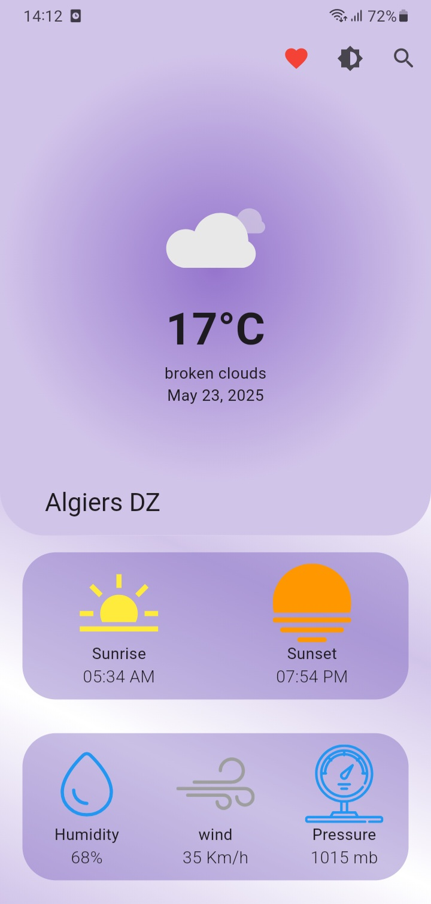
  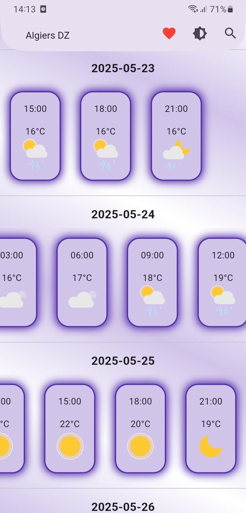
  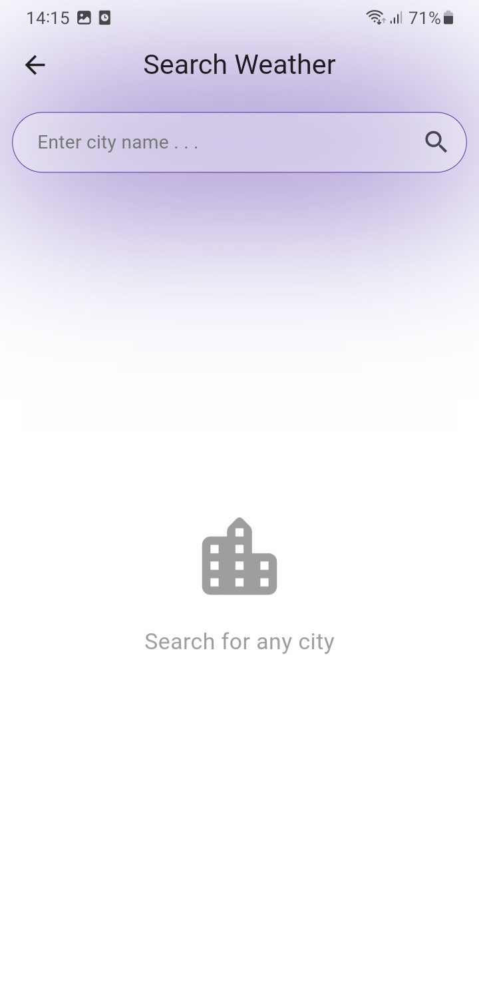

  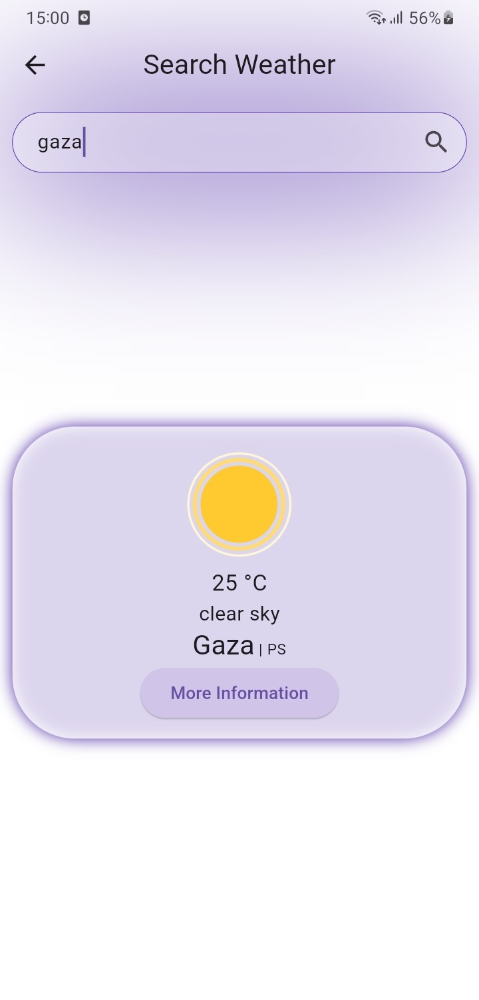
  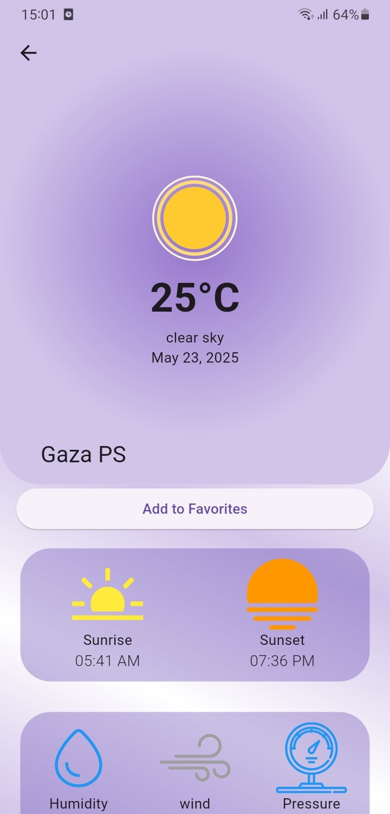
  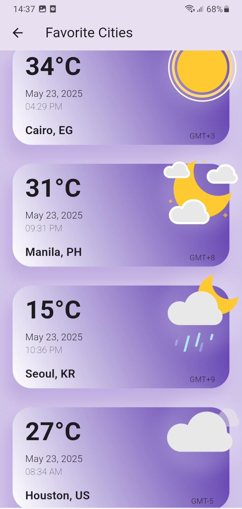

  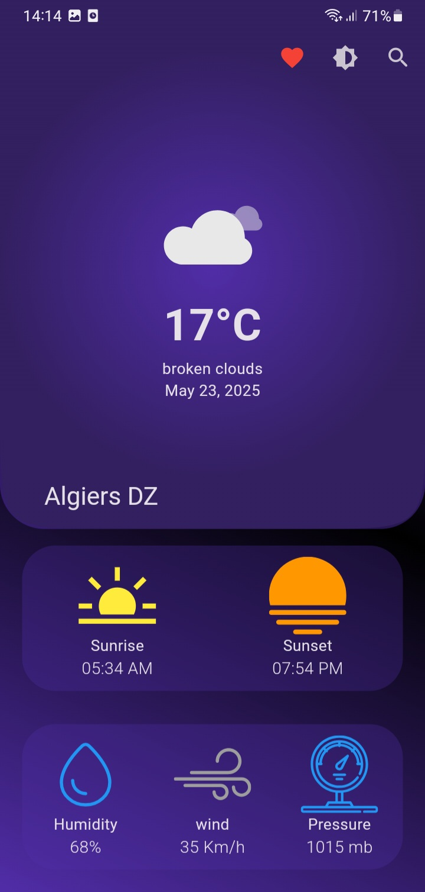
  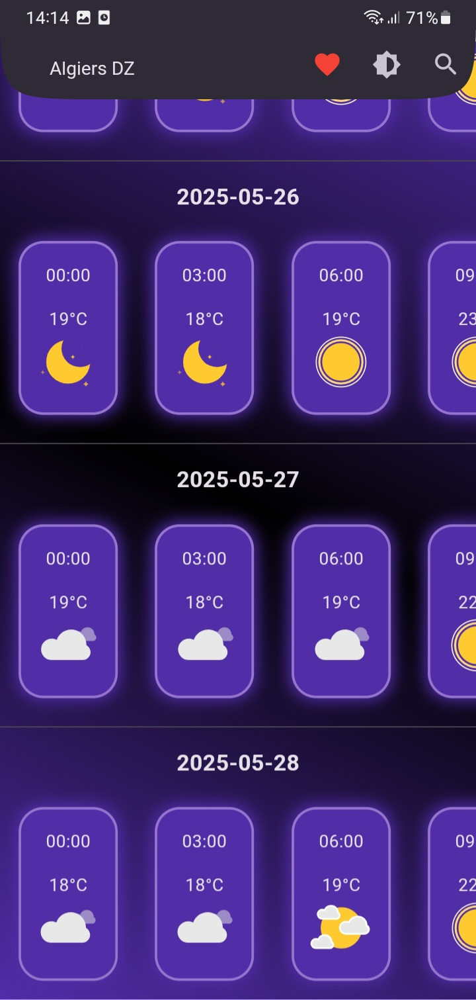
  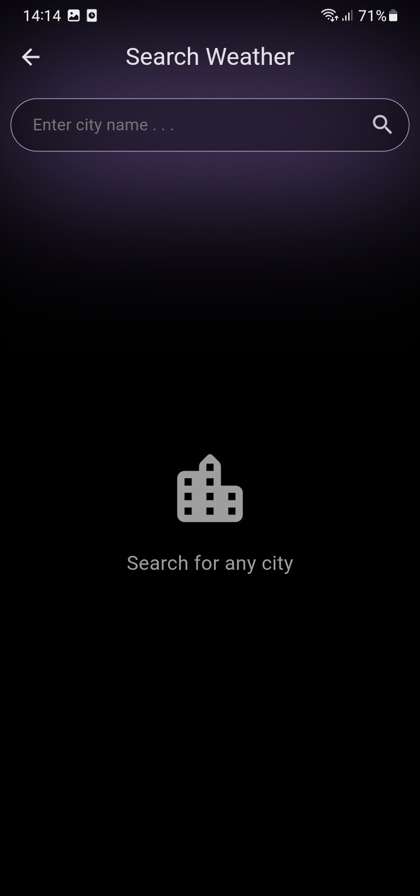

  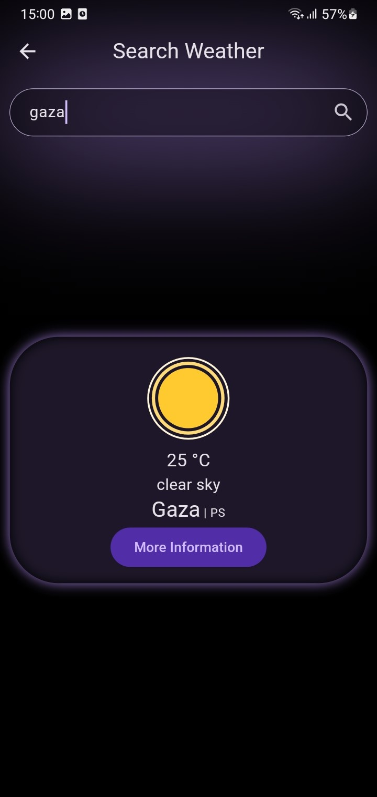
  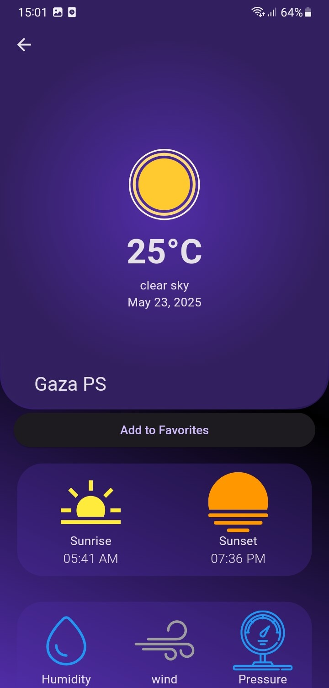
  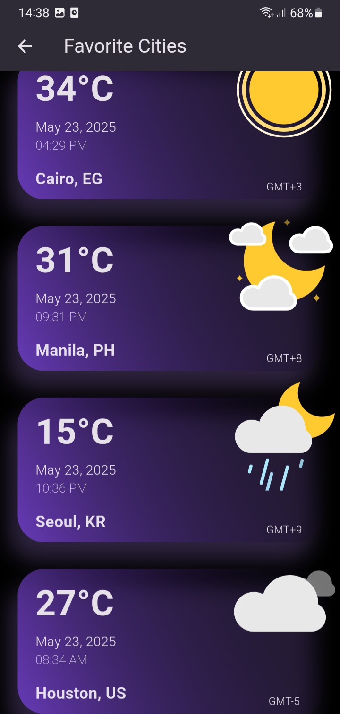

